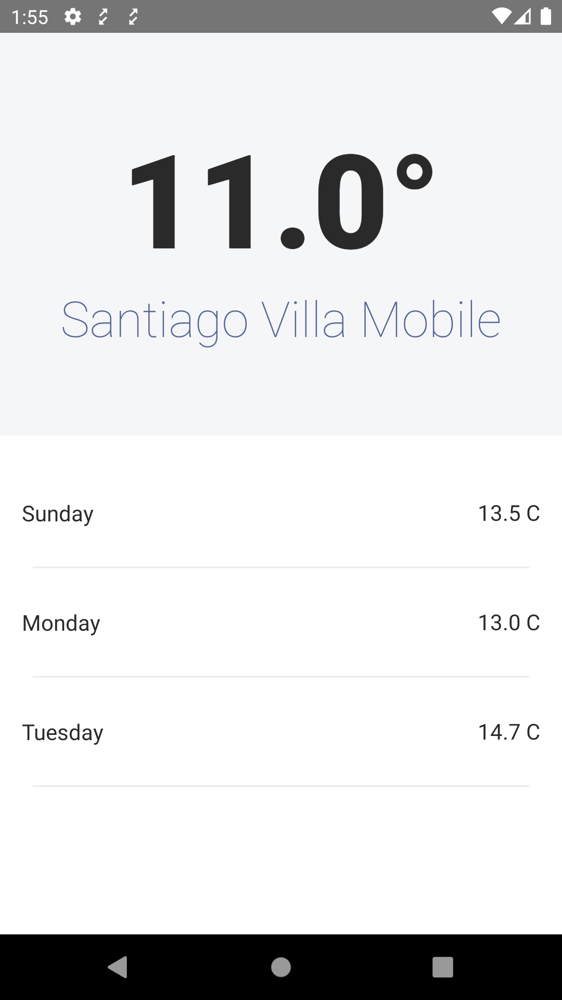

## Introduction

WeatherApp is a sample app to fetch current temperature of user's location and the average temperature forecast for next 3 days.
The app demonstrates a basic version of clean architecture where modules are mapped to layers of Clean Architecture.

## Third party libraries -

1. RxJava
2. RxAndroid
3. OkHttp
4. Retrofit
5. Dagger
7. Mockito
8. Jetpack

## Steps to Run

To run the project register on https://api.weatherapi.com and insert your API key in WeatherForecastServiceFactory class at "YOUR_API_KEY_HERE"

## SDK Specifications

minSdkVersion - 21
targetSdkVersion - 30
compileSdkVersion - 30

## Architecture

The app follows [Clean Architecture](https://blog.cleancoder.com/uncle-bob/2012/08/13/the-clean-architecture.html) where different layers are modularized in sub-modules.

### Domain
This module is the business logic layer which contains all usecases, repository and models.

### Data
This module is the outer framework layer in Clean Architecture which knows how to fetch data from different sources

### App
This module is presentation layer which interacts with usecase to fetch data and shosw them to user.

## Screenshots

